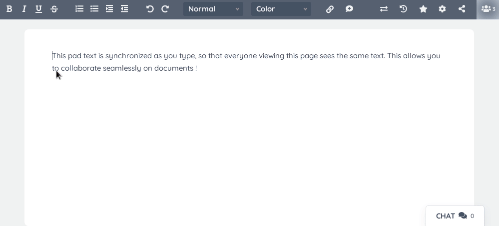
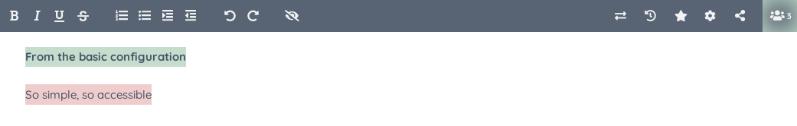

# A real-time collaborative editor for the web



# About
Etherpad is a real-time collaborative editor [scalable to thousands of simultaneous real time users](http://scale.etherpad.org/). It provides [full data export](https://github.com/ether/etherpad-lite/wiki/Understanding-Etherpad's-Full-Data-Export-capabilities) capabilities, and runs on _your_ server, under _your_ control.

# Try it out
Etherpad is extremely flexible providing you the means to modify it to solve whatever problem your community has.  We provide some demo instances for you try different experiences available within Etherpad.  Pad content is automatically removed after 24 hours.

* [Rich Editing](https://rich.etherpad.com) - A full rich text WYSIWYG editor.
* [Minimalist editor](https://minimalist.etherpad.com) - A minimalist editor that can be embedded within your tool.
* [Dark Mode](https://dark.etherpad.com) - Theme settings to have Etherpad start in dark mode, ideal for using Etherpad at night or for long durations.
* [Images](https://image.etherpad.com) - Plugins to improve provide Image support within a pad.
* [Video Chat](https://video.etherpad.com) - Plugins to enable Video and Audio chat in a pad.
* [Collaboration++](https://collab.etherpad.com) - Plugins to improve the really-real time collaboration experience, suitable for busy pads.
* [Document Analysis](https://analysis.etherpad.com) - Plugins to improve author and document analysis during and post creation.
* [Scale](https://shard.etherpad.com) - Etherpad running at scale with pad sharding which allows Etherpad to scale to ∞ number of Active Pads with up to ~20,000 edits per second, per pad.

# Project Status

### Code Quality
[](https://github.com/ether/etherpad-lite/actions/workflows/codeql-analysis.yml) [](https://lgtm.com/projects/g/ether/etherpad-lite/alerts/) [](https://lgtm.com/projects/g/ether/etherpad-lite/context:javascript) [](https://github.com/ether/etherpad-lite/actions/workflows/lint-package-lock.yml)

### Testing
[](https://github.com/ether/etherpad-lite/actions/workflows/backend-tests.yml) [](https://github.com/ether/etherpad-lite/actions/workflows/load-test.yml) [](https://github.com/ether/etherpad-lite/actions/workflows/rate-limit.yml) [](https://github.com/ether/etherpad-lite/actions/workflows/windows-zip.yml) [](https://github.com/ether/etherpad-lite/actions/workflows/dockerfile.yml)
[](https://github.com/ether/etherpad-lite/actions/workflows/frontend-admin-tests.yml) [](https://github.com/ether/etherpad-lite/actions/workflows/frontend-tests.yml) [](https://saucelabs.com/u/etherpad) [](https://github.com/ether/etherpad-lite/actions/workflows/windows-installer.yml)

### Engagement
<a href="https://hub.docker.com/r/etherpad/etherpad"></a> [](https://discord.com/invite/daEjfhw) [](https://static.etherpad.org/index.html)  

# Installation

## Requirements
- [Node.js](https://nodejs.org/) >= **12.13.0**.

## GNU/Linux and other UNIX-like systems

### Quick install on Debian/Ubuntu
```
curl -sL https://deb.nodesource.com/setup_14.x | sudo -E bash -
sudo apt install -y nodejs
git clone --branch master https://github.com/ether/etherpad-lite.git &&
cd etherpad-lite &&
src/bin/run.sh
```

### Manual install

You'll need Git and [Node.js](https://nodejs.org/) installed.

**As any user (we recommend creating a separate user called etherpad):**

1. Move to a folder where you want to install Etherpad. Clone the git repository: `git clone --branch master git://github.com/ether/etherpad-lite.git`
2. Change into the new directory containing the cloned source code: `cd etherpad-lite`
3. run `src/bin/run.sh` and open <http://127.0.0.1:9001> in your browser.

To update to the latest released version, execute `git pull origin`. The next
start with `src/bin/run.sh` will update the dependencies.

[Next steps](#next-steps).

## Windows

### Prebuilt Windows package
This package runs on any Windows machine. You can perform a manual installation via git for development purposes, but as this uses symlinks which performs unreliably on Windows, please stick to the prebuilt package if possible.

1. [Download the latest Windows package](https://etherpad.org/#download)
2. Extract the folder

Run `start.bat` and open <http://localhost:9001> in your browser. You like it? [Next steps](#next-steps).

### Manually install on Windows
You'll need [node.js](https://nodejs.org) and (optionally, though recommended) git.

1. Grab the source, either
  - download <https://github.com/ether/etherpad-lite/zipball/master>
  - or `git clone --branch master https://github.com/ether/etherpad-lite.git`
2. With a "Run as administrator" command prompt execute
   `src\bin\installOnWindows.bat`

Now, run `start.bat` and open <http://localhost:9001> in your browser.

Update to the latest version with `git pull origin`, then run
`src\bin\installOnWindows.bat`, again.

If cloning to a subdirectory within another project, you may need to do the following:

1. Start the server manually (e.g. `node src/node/server.js`)
2. Edit the db `filename` in `settings.json` to the relative directory with the file (e.g. `application/lib/etherpad-lite/var/dirty.db`)
3. Add auto-generated files to the main project `.gitignore`

## Docker container

Find [here](doc/docker.md) information on running Etherpad in a container.

# Next Steps

## Tweak the settings
You can modify the settings in `settings.json`.
If you need to handle multiple settings files, you can pass the path to a
settings file to `src/bin/run.sh` using the `-s|--settings` option: this allows
you to run multiple Etherpad instances from the same installation.
Similarly, `--credentials` can be used to give a settings override file, `--apikey` to give a different APIKEY.txt file and `--sessionkey` to give a non-default SESSIONKEY.txt.
**Each configuration parameter can also be set via an environment variable**, using the syntax `"${ENV_VAR}"` or `"${ENV_VAR:default_value}"`. For details, refer to `settings.json.template`.
Once you have access to your `/admin` section settings can be modified through the web browser.

If you are planning to use Etherpad in a production environment, you should use a dedicated database such as `mysql`, since the `dirtyDB` database driver is only for testing and/or development purposes.

## Secure your installation
If you have enabled authentication in `users` section in `settings.json`, it is a good security practice to **store hashes instead of plain text passwords** in that file. This is _especially_ advised if you are running a production installation.

Please install [ep_hash_auth plugin](https://www.npmjs.com/package/ep_hash_auth) and configure it.
If you prefer, `ep_hash_auth` also gives you the option of storing the users in a custom directory in the file system, without having to edit `settings.json` and restart Etherpad each time.

## Customize functionalities with plugins




Etherpad is very customizable through plugins. Instructions for installing themes and plugins can be found in [the plugin wiki article](https://github.com/ether/etherpad-lite/wiki/Available-Plugins).

## Getting the full features
Run the following command in your Etherpad folder to get all of the features visible in the demo gif:

```
npm install --no-save --legacy-peer-deps ep_headings2 ep_markdown ep_comments_page ep_align ep_font_color ep_webrtc ep_embedded_hyperlinks2
```

## Customize the style with skin variants

Open <http://127.0.0.1:9001/p/test#skinvariantsbuilder> in your browser and start playing !


## Helpful resources
The [wiki](https://github.com/ether/etherpad-lite/wiki) is your one-stop resource for Tutorials and How-to's.

Documentation can be found in `doc/`.

# Development

## Things you should know

You can debug Etherpad using `src/bin/debugRun.sh`.

You can run Etherpad quickly launching `src/bin/fastRun.sh`. It's convenient for
developers and advanced users. Be aware that it will skip the dependencies
update, so remember to run `src/bin/installDeps.sh` after installing a new
dependency or upgrading version.

If you want to find out how Etherpad's `Easysync` works (the library that makes it really realtime), start with this [PDF](https://github.com/ether/etherpad-lite/raw/master/doc/easysync/easysync-full-description.pdf) (complex, but worth reading).

## Contributing
Read our [**Developer Guidelines**](https://github.com/ether/etherpad-lite/blob/master/CONTRIBUTING.md)

# Get in touch
The official channel for contacting the development team is via the [Github issues](https://github.com/ether/etherpad-lite/issues).

For **responsible disclosure of vulnerabilities**, please write a mail to the maintainers (a.mux@inwind.it and contact@etherpad.org).
Join the official [Etherpad Discord Channel](https://discord.com/invite/daEjfhw)

# HTTP API
Etherpad is designed to be easily embeddable and provides a [HTTP API](https://github.com/ether/etherpad-lite/wiki/HTTP-API)
that allows your web application to manage pads, users and groups. It is recommended to use the [available client implementations](https://github.com/ether/etherpad-lite/wiki/HTTP-API-client-libraries) in order to interact with this API.

OpenAPI (previously swagger) definitions for the API are exposed under `/api/openapi.json`.

# jQuery plugin
There is a [jQuery plugin](https://github.com/ether/etherpad-lite-jquery-plugin) that helps you to embed Pads into your website.

# Plugin Framework
Etherpad offers a plugin framework, allowing you to easily add your own features. By default your Etherpad is extremely light-weight and it's up to you to customize your experience. Once you have Etherpad installed you should [visit the plugin page](https://static.etherpad.org/) and take control.

# Translations / Localizations  (i18n / l10n)
Etherpad comes with translations into all languages thanks to the team at [TranslateWiki](https://translatewiki.net/).

If you require translations in [plugins](https://static.etherpad.org/) please send pull request to each plugin individually.

# FAQ
Visit the **[FAQ](https://github.com/ether/etherpad-lite/wiki/FAQ)**.

# License
[Apache License v2](http://www.apache.org/licenses/LICENSE-2.0.html)
