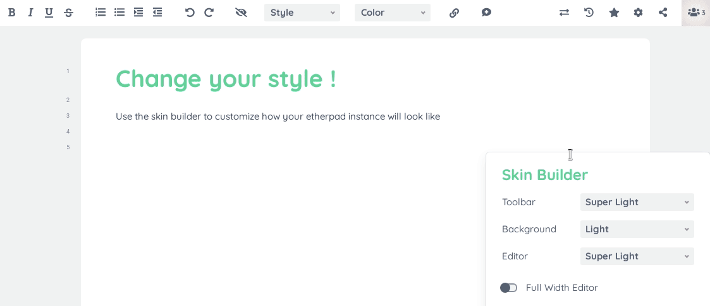

# A real-time collaborative editor for the web
<a href="https://hub.docker.com/r/etherpad/etherpad"></a>
[](https://travis-ci.org/github/ether/etherpad-lite)


# About
Etherpad is a real-time collaborative editor scalable to thousands of simultaneous real time users. It provides full data export capabilities, and runs on _your_ server, under _your_ control.

**[Try it out](https://video.etherpad.com)**

# Installation

## Requirements
- `nodejs` >= **10.13.0**.

## GNU/Linux and other UNIX-like systems

### Quick install on Debian/Ubuntu
```
curl -sL https://deb.nodesource.com/setup_10.x | sudo -E bash -
sudo apt install -y nodejs
git clone --branch master https://github.com/ether/etherpad-lite.git && cd etherpad-lite && bin/run.sh
```

### Manual install
You'll need git and [node.js](https://nodejs.org) installed (minimum required Node version: **10.13.0**).

**As any user (we recommend creating a separate user called etherpad):**

1. Move to a folder where you want to install Etherpad. Clone the git repository: `git clone --branch master git://github.com/ether/etherpad-lite.git`
2. Change into the new directory containing the cloned source code: `cd etherpad-lite`
3. run `bin/run.sh` and open <http://127.0.0.1:9001> in your browser.

To update to the latest released version, execute `git pull origin`. The next start with `bin/run.sh` will update the dependencies.

[Next steps](#next-steps).

## Windows

### Prebuilt Windows package
This package runs on any Windows machine, but for development purposes, please do a manual install.

1. [Download the latest Windows package](https://etherpad.org/#download)
2. Extract the folder

Run `start.bat` and open <http://localhost:9001> in your browser. You like it? [Next steps](#next-steps).

### Manually install on Windows
You'll need [node.js](https://nodejs.org) and (optionally, though recommended) git.

1. Grab the source, either
  - download <https://github.com/ether/etherpad-lite/zipball/master>
  - or `git clone --branch master https://github.com/ether/etherpad-lite.git`
2. With a "Run as administrator" command prompt execute `bin\installOnWindows.bat`

Now, run `start.bat` and open <http://localhost:9001> in your browser.

Update to the latest version with `git pull origin`, then run `bin\installOnWindows.bat`, again.

If cloning to a subdirectory within another project, you may need to do the following:

1. Start the server manually (e.g. `node/node_modules/ep_etherpad-lite/node/server.js`)
2. Edit the db `filename` in `settings.json` to the relative directory with the file (e.g. `application/lib/etherpad-lite/var/dirty.db`)
3. Add auto-generated files to the main project `.gitignore`

## Docker container

Find [here](doc/docker.md) information on running Etherpad in a container.

# Next Steps

## Tweak the settings
You can modify the settings in `settings.json`.
If you need to handle multiple settings files, you can pass the path to a settings file to `bin/run.sh` using the `-s|--settings` option: this allows you to run multiple Etherpad instances from the same installation.
Similarly, `--credentials` can be used to give a settings override file, `--apikey` to give a different APIKEY.txt file and `--sessionkey` to give a non-default SESSIONKEY.txt.
**Each configuration parameter can also be set via an environment variable**, using the syntax `"${ENV_VAR}"` or `"${ENV_VAR:default_value}"`. For details, refer to `settings.json.template`.
Once you have access to your `/admin` section settings can be modified through the web browser.

If you are planning to use Etherpad in a production environment, you should use a dedicated database such as `mysql`, since the `dirtyDB` database driver is only for testing and/or development purposes.

## Secure your installation
If you have enabled authentication in `users` section in `settings.json`, it is a good security practice to **store hashes instead of plain text passwords** in that file. This is _especially_ advised if you are running a production installation.

Please install [ep_hash_auth plugin](https://www.npmjs.com/package/ep_hash_auth) and configure it.
If you prefer, `ep_hash_auth` also gives you the option of storing the users in a custom directory in the file system, without having to edit `settings.json` and restart Etherpad each time.

## Customize functionalities with plugins


Etherpad is very customizable through plugins. Instructions for installing themes and plugins can be found in [the plugin wiki article](https://github.com/ether/etherpad-lite/wiki/Available-Plugins).

## Customize the style with skin variants

Open <http://127.0.0.1:9001/p/test#skinvariantsbuilder> in your browser and start playing !



## Helpful resources
The [wiki](https://github.com/ether/etherpad-lite/wiki) is your one-stop resource for Tutorials and How-to's.

Documentation can be found in `doc/`.

# Development

## Things you should know
You can debug Etherpad using `bin/debugRun.sh`.

You can run Etherpad quickly launching `bin/fastRun.sh`. It's convenient for developers and advanced users. Be aware that it will skip the dependencies update, so remember to run `bin/installDeps.sh` after installing a new dependency or upgrading version.

If you want to find out how Etherpad's `Easysync` works (the library that makes it really realtime), start with this [PDF](https://github.com/ether/etherpad-lite/raw/master/doc/easysync/easysync-full-description.pdf) (complex, but worth reading).

## Contributing
Read our [**Developer Guidelines**](https://github.com/ether/etherpad-lite/blob/master/CONTRIBUTING.md)

# Get in touch
The official channel for contacting the development team is via the [Github issues](https://github.com/ether/etherpad-lite/issues).

For **responsible disclosure of vulnerabilities**, please write a mail to the maintainer (a.mux@inwind.it).

# HTTP API
Etherpad is designed to be easily embeddable and provides a [HTTP API](https://github.com/ether/etherpad-lite/wiki/HTTP-API)
that allows your web application to manage pads, users and groups. It is recommended to use the [available client implementations](https://github.com/ether/etherpad-lite/wiki/HTTP-API-client-libraries) in order to interact with this API.

OpenAPI (previously swagger) definitions for the API are exposed under `/api/openapi.json`.

# jQuery plugin
There is a [jQuery plugin](https://github.com/ether/etherpad-lite-jquery-plugin) that helps you to embed Pads into your website.

# Plugin Framework
Etherpad offers a plugin framework, allowing you to easily add your own features. By default your Etherpad is extremely light-weight and it's up to you to customize your experience. Once you have Etherpad installed you should visit the plugin page and take control.

# Translations / Localizations  (i18n / l10n)
Etherpad comes with translations into all languages thanks to the team at TranslateWiki.

# FAQ
Visit the **[FAQ](https://github.com/ether/etherpad-lite/wiki/FAQ)**.

# License
[Apache License v2](http://www.apache.org/licenses/LICENSE-2.0.html)
